# 第10 单元 vue前端基础工程 

# 【授课重点】

1. **前端知识复习**
2. **ECMAScript6简明教程（简称**ES6）
3. **Node.js和NPM**
4. **vue简介**
5. **前端工程搭建**

# 【考核要求】

1. **前端知识复习**
2. **ECMAScript6简明教程（简称**ES6）
3. **Node.js和NPM**
4. **vue简介**
5. **前端工程搭建**

# 【教学内容】

## 10.1前端知识复习

- http协议

  http是一个简单的请求-响应协议，它通常运行在TCP之上。它指定了客户端可能发送给服务器什么样的消息以及得到什么样的响应。请求和响应消息的头以ASCII码形式给出；而消息内容则具有一个类似MIME的格式。这个简单模型是早期Web成功的有功之臣，因为它使得开发和部署是那么的直截了当.

- W3C标准

  万维网联盟（外语缩写：W3C）标准不是某一个标准，而是一系列标准的集合。网页主要由三部分组成：结构（Structure）、表现（Presentation）和行为（Behavior）。

- html5

  HTML5是构建Web内容的一种语言描述方式。HTML5是互联网的下一代标准，是构建以及呈现互联网内容的一种语言方式．被认为是互联网的核心技术之一。HTML产生于1990年，1997年HTML4成为互联网标准，并广泛应用于互联网应用的开发。

  HTML5是Web中核心语言HTML的规范，用户使用任何手段进行网页浏览时看到的内容原本都是HTML格式的，在浏览器中通过一些技术处理将其转换成为了可识别的信息。HTML5在从前HTML4.01的基础上进行了一定的改进，虽然技术人员在开发过程中可能不会将这些新技术投入应用，但是对于该种技术的新特性，网站开发技术人员是必须要有所了解的。 

- 基于Http协议设计网页应用优势与不足

  <https://blog.csdn.net/weixin_45519387/article/details/103930795>

## 10.2 ECMAScript6简明教程（简称ES6）

- 什么是ECMAScript6 ？

  [ECMAScript](https://baike.baidu.com/item/ECMAScript/1889420) 6（简称ES6）是于2015年6月正式发布的[JavaScript](https://baike.baidu.com/item/JavaScript/321142)语言的标准，正式名为ECMAScript 2015（ES2015）。它的目标是使得JavaScript语言可以用来编写复杂的大型应用程序，成为企业级开发语言.

  **ECMAScript 和 JavaScript 的关系** 

  一个常见的问题是，ECMAScript 和 JavaScript 到底是什么关系？

  要讲清楚这个问题，需要回顾历史。1996 年 11 月，JavaScript 的创造者 Netscape 公司，决定将 JavaScript 提交给标准化组织 ECMA，希望这种语言能够成为国际标准。次年，ECMA 发布 262 号标准文件（ECMA-262）的第一版，规定了浏览器脚本语言的标准，并将这种语言称为 ECMAScript，这个版本就是 1.0 版。

  该标准从一开始就是针对 JavaScript 语言制定的，但是之所以不叫 JavaScript，有两个原因。一是商标，Java 是 Sun 公司的商标，根据授权协议，只有 Netscape 公司可以合法地使用 JavaScript 这个名字，且 JavaScript 本身也已经被 Netscape 公司注册为商标。二是想体现这门语言的制定者是 ECMA，不是 Netscape，这样有利于保证这门语言的开放性和中立性。

  因此，ECMAScript 和 JavaScript 的关系是，前者是后者的规格，后者是前者的一种实现（另外的 ECMAScript 方言还有 JScript 和 ActionScript）。日常场合，这两个词是可以互换的。

- let、const 和 block 作用域

  ES6 新增了`let`命令，用来声明变量。它的用法类似于`var`，但是所声明的变量，只在`let`命令所在的代码块内有效。

  ```javascript
  {
    let a = 10;
    var b = 1;
  }
  
  a // ReferenceError: a is not defined.
  b // 1
  ```

  上面代码在代码块之中，分别用`let`和`var`声明了两个变量。然后在代码块之外调用这两个变量，结果`let`声明的变量报错，`var`声明的变量返回了正确的值。这表明，`let`声明的变量只在它所在的代码块有效

  `for`循环的计数器，就很合适使用`let`命令。

  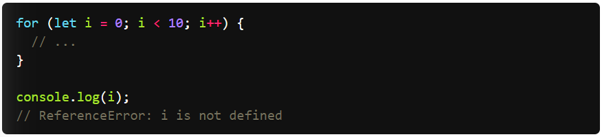 

  上面代码中，计数器`i`只在`for`循环体内有效，在循环体外引用就会报错。

  下面的代码如果使用`var`，最后输出的是`10`。

  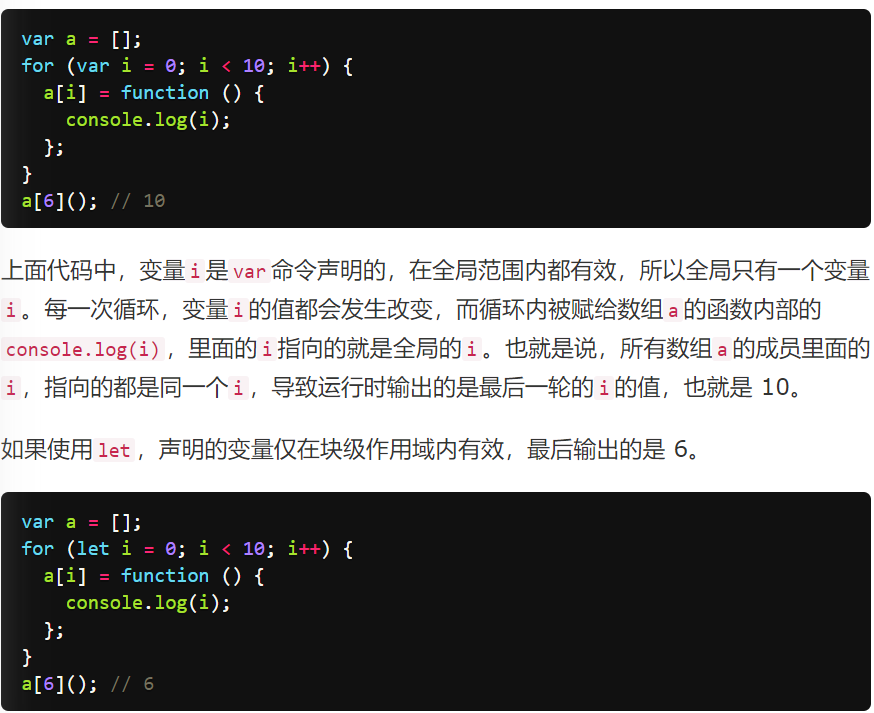 

  上面代码中，变量`i`是`let`声明的，当前的`i`只在本轮循环有效，所以每一次循环的`i`其实都是一个新的变量，所以最后输出的是`6`。你可能会问，如果每一轮循环的变量`i`都是重新声明的，那它怎么知道上一轮循环的值，从而计算出本轮循环的值？这是因为 JavaScript 引擎内部会记住上一轮循环的值，初始化本轮的变量`i`时，就在上一轮循环的基础上进行计算。

  另外，`for`循环还有一个特别之处，就是设置循环变量的那部分是一个父作用域，而循环体内部是一个单独的子作用域。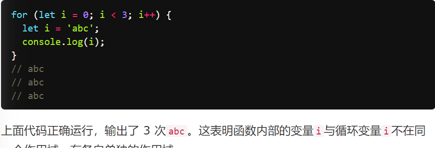 

- 箭头函数（Arrow Functions)

  <https://es6.ruanyifeng.com/#docs/destructuring>

- 函数参数默认值

  <https://es6.ruanyifeng.com/#docs/destructuring>

- Spread / Rest 操作符

  <https://es6.ruanyifeng.com/#docs/destructuring>

- 对象词法扩展

  <https://es6.ruanyifeng.com/#docs/destructuring>

- 对象和数组解构

  <https://es6.ruanyifeng.com/#docs/destructuring>

- 模板语法和分隔符

  <https://es6.ruanyifeng.com/#docs/destructuring>

- for...of VS for...in

  JavaScript 原有的表示“集合”的数据结构，主要是数组（`Array`）和对象（`Object`），ES6 又添加了`Map`和`Set`。这样就有了四种数据集合，用户还可以组合使用它们，定义自己的数据结构，比如数组的成员是`Map`，`Map`的成员是对象。这样就需要一种统一的接口机制，来处理所有不同的数据结构。

  遍历器（Iterator）就是这样一种机制。它是一种接口，为各种不同的数据结构提供统一的访问机制。任何数据结构只要部署 Iterator 接口，就可以完成遍历操作（即依次处理该数据结构的所有成员）。

  Iterator 的作用有三个：一是为各种数据结构，提供一个统一的、简便的访问接口；二是使得数据结构的成员能够按某种次序排列；三是 ES6 创造了一种新的遍历命令`for...of`循环，Iterator 接口主要供`for...of`消费。

  Iterator 的遍历过程是这样的。

  （1）创建一个指针对象，指向当前数据结构的起始位置。也就是说，遍历器对象本质上，就是一个指针对象。

  （2）第一次调用指针对象的`next`方法，可以将指针指向数据结构的第一个成员。

  （3）第二次调用指针对象的`next`方法，指针就指向数据结构的第二个成员。

  （4）不断调用指针对象的`next`方法，直到它指向数据结构的结束位置。

  每一次调用`next`方法，都会返回数据结构的当前成员的信息。具体来说，就是返回一个包含`value`和`done`两个属性的对象。其中，`value`属性是当前成员的值，`done`属性是一个布尔值，表示遍历是否结束。

  下面是一个模拟`next`方法返回值的例子。

  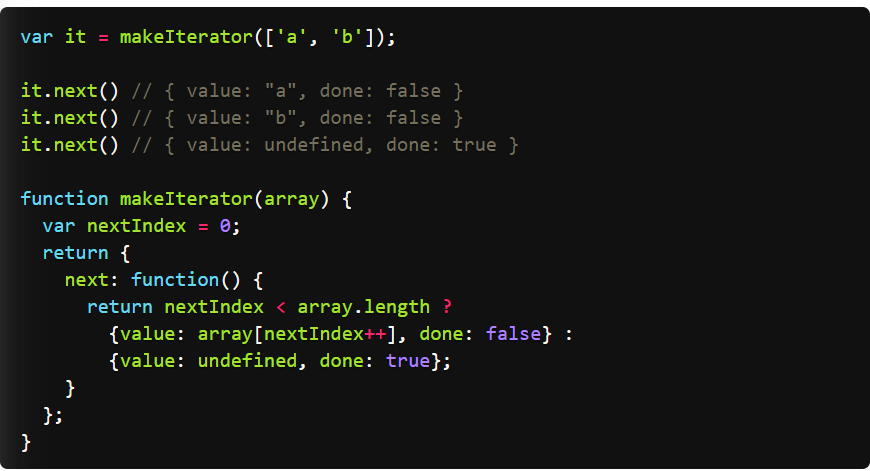 

  上面代码定义了一个`makeIterator`函数，它是一个遍历器生成函数，作用就是返回一个遍历器对象。对数组`['a', 'b']`执行这个函数，就会返回该数组的遍历器对象（即指针对象）`it`。

  指针对象的`next`方法，用来移动指针。开始时，指针指向数组的开始位置。然后，每次调用`next`方法，指针就会指向数组的下一个成员。第一次调用，指向`a`；第二次调用，指向`b`。

  `next`方法返回一个对象，表示当前数据成员的信息。这个对象具有`value`和`done`两个属性，`value`属性返回当前位置的成员，`done`属性是一个布尔值，表示遍历是否结束，即是否还有必要再一次调用`next`方法。

  总之，调用指针对象的`next`方法，就可以遍历事先给定的数据结构。

  对于遍历器对象来说，`done: false`和`value: undefined`属性都是可以省略的，因此上面的`makeIterator`函数可以简写成下面的形式。 

  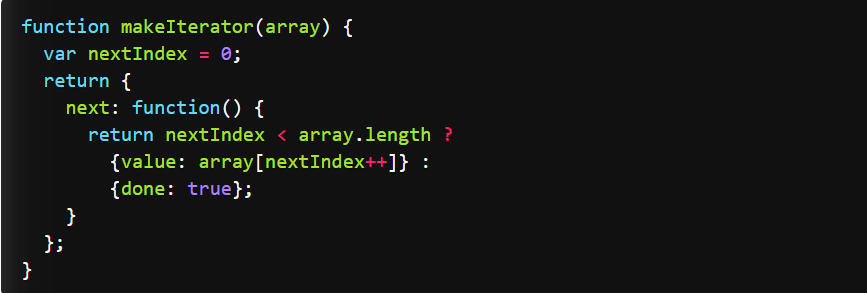 

  由于 Iterator 只是把接口规格加到数据结构之上，所以，遍历器与它所遍历的那个数据结构，实际上是分开的，完全可以写出没有对应数据结构的遍历器对象，或者说用遍历器对象模拟出数据结构。下面是一个无限运行的遍历器对象的例子

  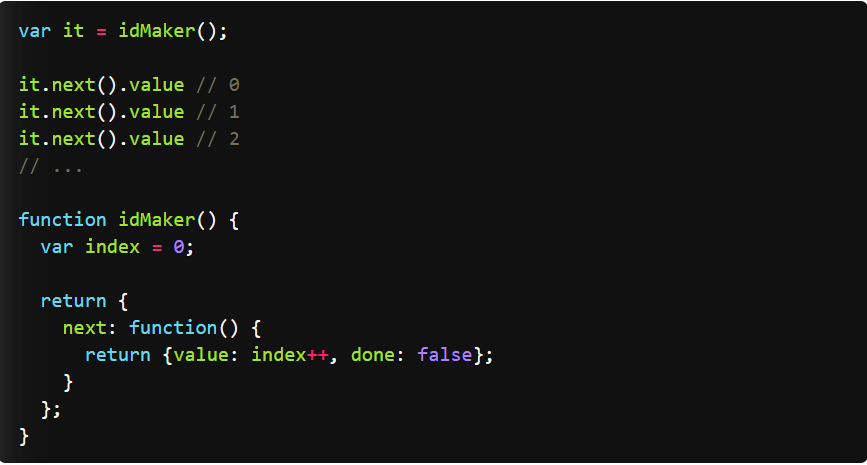 

  上面的例子中，遍历器生成函数`idMaker`，返回一个遍历器对象（即指针对象）。但是并没有对应的数据结构，或者说，遍历器对象自己描述了一个数据结构出来。

  如果使用 TypeScript 的写法，遍历器接口（Iterable）、指针对象（Iterator）和`next`方法返回值的规格可以描述如下。

  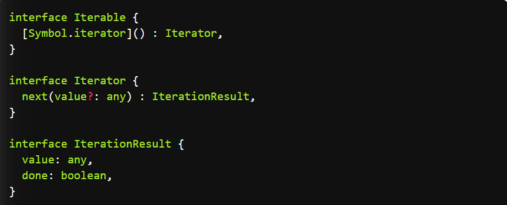 

- Import和Export

  <https://es6.ruanyifeng.com/#docs/iterator>

## 10.3 Node.js和NPM

- Node.js介绍

  Node.js 是一个基于 Chrome V8 引擎的 [JavaScript](https://baike.baidu.com/item/JavaScript/321142) 运行环境。 Node.js 使用了一个事件驱动、非阻塞式 I/O 的模型。 [1] 

  Node 是一个让 JavaScript 运行在[服务端](https://baike.baidu.com/item/服务端/6492316)的开发平台，它让 JavaScript 成为与[PHP](https://baike.baidu.com/item/PHP/9337)、[Python](https://baike.baidu.com/item/Python/407313)、[Perl](https://baike.baidu.com/item/Perl/851577)、[Ruby](https://baike.baidu.com/item/Ruby/11419) 等服务端语言平起平坐的[脚本语言](https://baike.baidu.com/item/脚本语言/1379708)。 [2]  发布于2009年5月，由Ryan Dahl开发，实质是对Chrome V8引擎进行了封装。

  Node对一些特殊用例进行优化，提供替代的[API](https://baike.baidu.com/item/API/10154)，使得V8在非浏览器环境下运行得更好。V8引擎执行Javascript的速度非常快，性能非常好。Node是一个基于Chrome JavaScript运行时建立的平台， 用于方便地搭建响应速度快、易于扩展的网络应用。Node 使用[事件驱动](https://baike.baidu.com/item/事件驱动/9597519)， 非阻塞[I/O](https://baike.baidu.com/item/I%2FO/84718) 模型而得以轻量和高效，非常适合在分布式设备上运行数据密集型的实时应用。

- Node.js安装

  - 找到老师为大家提供的安装包

    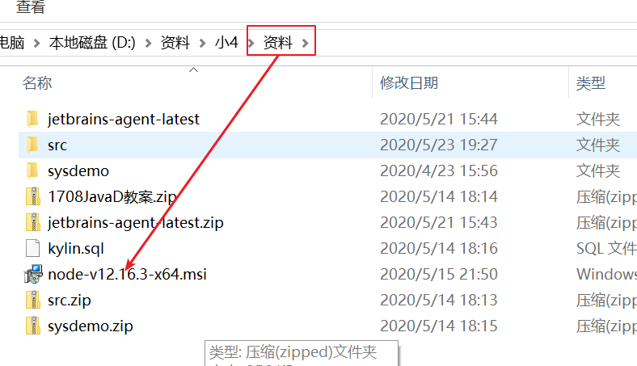 

  - 双击安装

    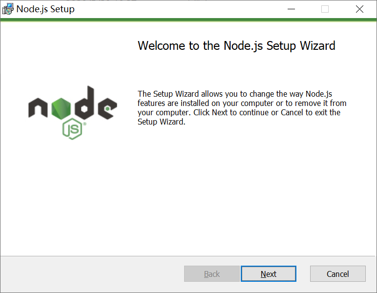 

    点击next

    然后选择安装路径即可完成安装!安装完成后再win上按下win+R键:

    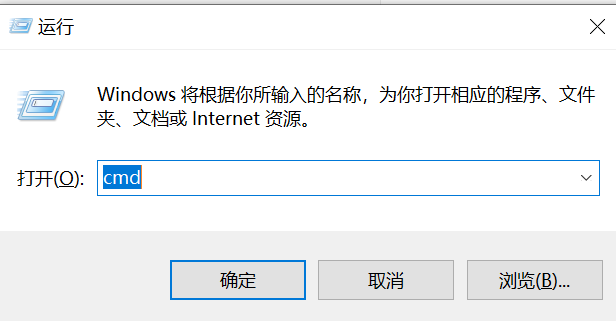 

    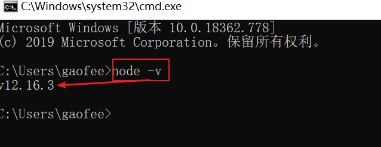 

    说明node的环境变量已经配置完毕,并且安装完毕!

    再次输入npm -v

    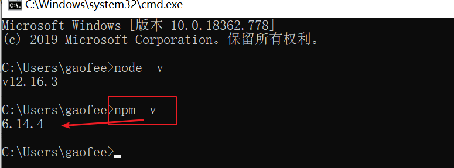 

    注意:安装nodejs的时候,node自动已经为我们安装好了npm

    

- Node.js功能理解

  Node作为一个新兴的前端框架，后台语言，有很多吸引人的地方：

  RESTful API

  单线程

  Node可以在不新增额外线程的情况下，依然可以对任务进行并发处理 —— Node.js是单线程的。它通过事件循环（event loop）来实现并发操作，对此，我们应该要充分利用这一点 —— 尽可能的避免阻塞操作，取而代之，多使用非阻塞操作。

  非阻塞IO

  V8虚拟机

  事件驱动

  Node使用Module模块去划分不同的功能，以简化应用的开发。Modules模块有点像C++语言中的类库。每一个Node的类库都包含了十分丰富的各类函数，比如http模块就包含了和http功能相关的很多函数，可以帮助开发者很容易地对比如http,tcp/udp等进行操作，还可以很容易的创建http和tcp/udp的服务器。

  要在程序中使用模块是十分方便的，只需要如下：

  在这里，引入了http类库，并且对http类库的引用存放在http变量中了。这个时候，Node会在我们应用中搜索是否存在node_modules的目录，并且搜索这个目录中是否存在http的模块。如果Node.js找不到这个目录，则会到全局模块缓存中去寻找，用户可以通过相对或者绝对路径，指定模块的位置，比如：

  var myModule = require('./myModule.js');

  模块中包含了很多功能代码片断，在模块中的代码大部分都是私有的，意思是在模块中定义的函数方法和变量，都只能在同一个模块中被调用。当然，可以将某些方法和变量暴露到模块外，这个时候可以使用exports对象去实现。

- NPM与仓库

  NPM是随同NodeJS一起安装的包管理工具，能解决NodeJS代码部署上的很多问题，常见的使用场景有以下几种：

  - 允许用户从NPM服务器下载别人编写的第三方包到本地使用。
  - 允许用户从NPM服务器下载并安装别人编写的命令行程序到本地使用。
  - 允许用户将自己编写的包或命令行程序上传到NPM服务器供别人使用。

  **注意我们可以把node理解为我们的java运行环境,npm理解成java的jar包管理工具的Maven**

## 10.4 vue简介

参考第8单元

## 10.5 前端工程搭建

- VUE脚手架工具

  vue-cli 脚手架工具

  工地上，脚手架是帮助工人作业搭建的架子。 vue-cli 可以帮助我们写好 vuejs 代码的工具，vue-cli 可以做什么：
   1、目录结构
   2、本地调试
   3、代码部署
   4、热更新
   5、单元测试 （ESlint）

  

- 创建VUE工程

  下面我们来利用脚手架工具类搭建项目

  #### 1.安装vue-cli

  **①** 使用npm（需要安装node环境）**全局安装webpack**，打开命令行工具输入：`npm install webpack -g`或者（`npm install -g webpack`），安装完成之后输入 `webpack -v`，如下图，如果出现相应的版本号，则说明安装成功。

  **②** **全局安装vue-cli**，在cmd中输入命令:

  ```
  npm install --global vue-cli
  ```

  （我已经安装过，为了更直观我在电脑上重新演示下）

  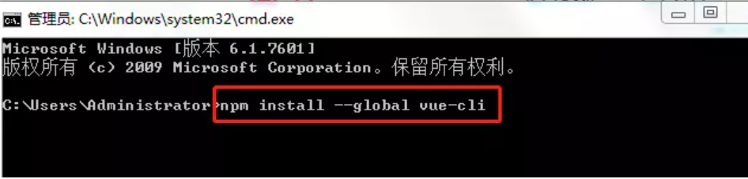 

  安装成功：

  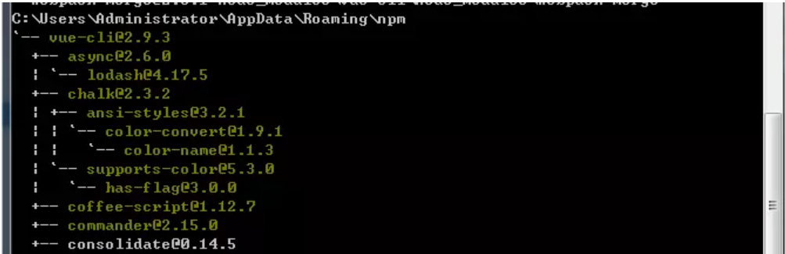 

  安装完成之后输入 vue -V（注意这里是大写的“V”），如下图，如果出现相应的版本号，则说明安装成功

  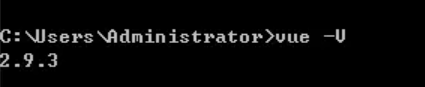 

  打开C:\Users\Andminster\AppData\Roaming\npm目录下可以看到：

  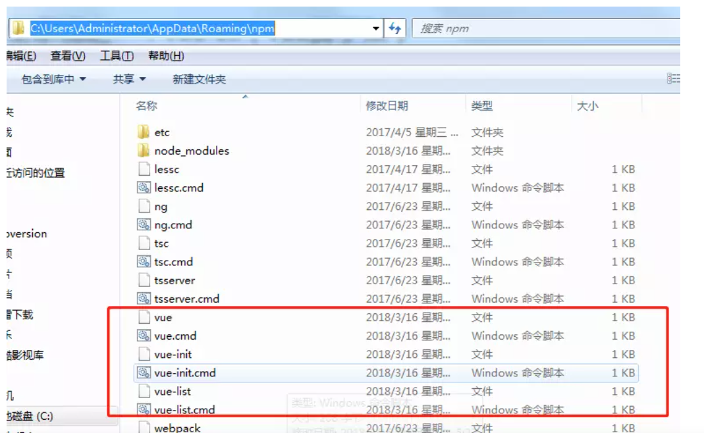 

  打开node_modules也可以看到：

  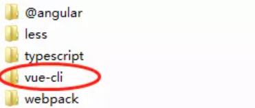 

  #### 2.用vue-cli来构建项目

  **①** 我首先在D盘新建一个文件夹（gaofei_vue）作为项目存放地，然后使用命令行cd进入到项目目录输入：

  ```
  vue init webpack gaofei_vue_demo
  ```

  gaofei_vue_demo是自定义的项目名称，命令执行之后，会在当前目录生成一个以该名称命名的项目文件夹。

  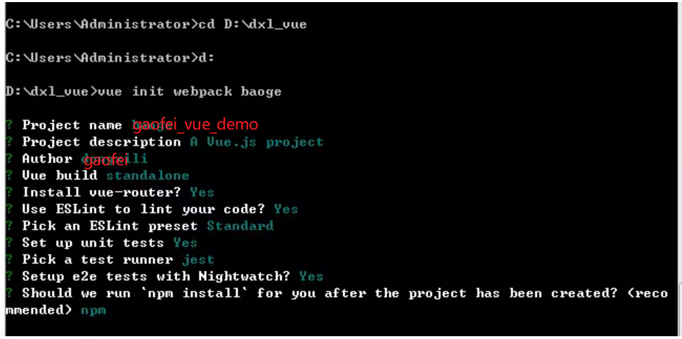 

  输入命令后，会跳出几个选项让你回答：

  - Project name (baoge)：     -----项目名称，直接回车，按照括号中默认名字（注意这里的名字不能有大写字母，如果有会报错Sorry, name can no longer contain capital letters），阮一峰老师博客[为什么文件名要小写](https://link.jianshu.com?t=http://www.ruanyifeng.com/blog/2017/02/filename-should-be-lowercase.html) ，可以参考一下。
  - Project description (A Vue.js project)：  ----项目描述，也可直接点击回车，使用默认名字
  - Author ()：       ----作者，输入dongxili
     接下来会让用户选择：
  - Runtime + Compiler: recommended for most users    运行加编译，既然已经说了推荐，就选它了
     Runtime-only: about 6KB lighter min+gzip, but templates (or any Vue-specificHTML) are ONLY allowed in .vue files - render functions are required elsewhere   仅运行时，已经有推荐了就选择第一个了
  - Install vue-router? (Y/n)    是否安装vue-router，这是官方的路由，大多数情况下都使用，这里就输入“y”后回车即可。
  - Use ESLint to lint your code? (Y/n)      是否使用ESLint管理代码，ESLint是个代码风格管理工具，是用来统一代码风格的，一般项目中都会使用。
     接下来也是选择题Pick an ESLint preset (Use arrow keys)            选择一个ESLint预设，编写vue项目时的代码风格，直接y回车
  - Setup unit tests with Karma + Mocha? (Y/n)  是否安装单元测试，我选择安装y回车
  - Setup e2e tests with Nightwatch(Y/n)?     是否安装e2e测试 ，我选择安装y回车

  回答完毕后上图就开始构建项目了。

  **②** 配置完成后，可以看到目录下多出了一个项目文件夹gaofei_vue_demo，然后cd进入这个文件夹：
  **安装依赖**：

  ```undefined
  npm install
  ```

  ( 如果安装速度太慢。可以安装淘宝镜像，打开命令行工具，输入：
    `npm install -g cnpm --registry=https://registry.npm.taobao.org`
    然后使用`cnpm`来安装 )

  npm install ：安装所有的模块，如果是安装具体的哪个个模块，在install 后面输入模块的名字即可。而只输入install就会按照项目的根目录下的package.json文件中依赖的模块安装（这个文件里面是不允许有任何注释的），每个使用npm管理的项目都有这个文件，是npm操作的入口文件。因为是初始项目，还没有任何模块，所以我用npm install 安装所有的模块。安装完成后，目录中会多出来一个node_modules文件夹，这里放的就是所有依赖的模块。
   然后现在，gaofei_vue_demo文件夹里的目录是这样的：

  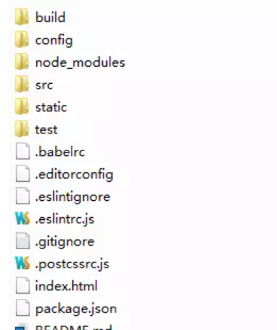 

  解释下每个文件夹代表的意思(仔细看一下这张图）:

  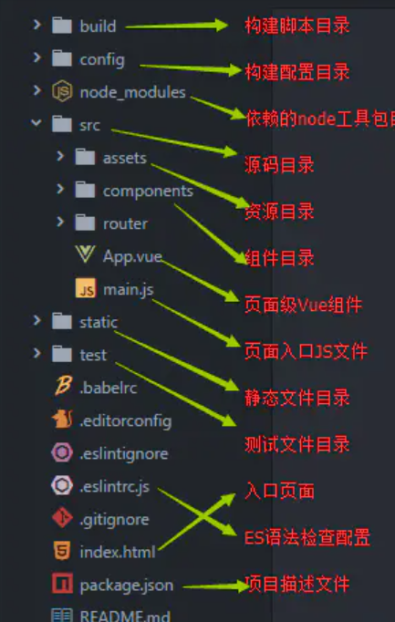 

  ok,我们的骨架工程已经成功搭建~

- 前端常用IDE介绍：VScode、Webstorm、HBuilder、IntelliJ IDEA


