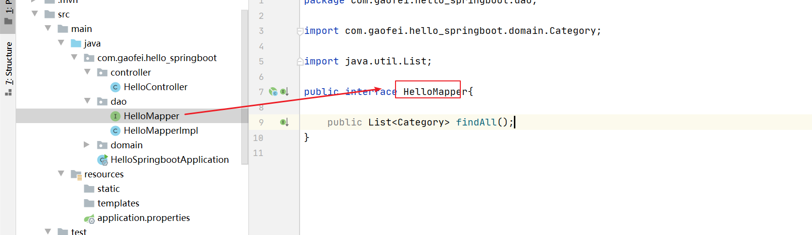

# 第一单元  第一个SpringBoot程序

# 【授课重点】

1. Spring回顾
2. SpringBoot介绍
3. 第一个SpringBoot程序
4. 初识Starter
5. 基本配置
6. SpringBoot连接数据库

# 【考核要求】

1. Spring回顾
2. SpringBoot介绍
3. 第一个SpringBoot程序
4. 初识Starter
5. 基本配置
6. SpringBoot连接数据库

# 【教学内容】

# 1.1 Spring回顾

- **为什么会出现spring?**

我们使用spring这个框架已经有一段时间了,但是我们为什么要使用spring呢?

spring 是一个开源的轻量级 JavaBean 容器框架。使用 JavaBean 代替 EJB ，并提供了丰富的企业应用功能，降低应用开发的复杂性。

- 轻量：非入侵性的、所依赖的东西少、资源占用少、部署简单，不同功能选择不同的 jar 组合
- 容器：工厂模式实现对 JavaBean 进行管理，通过控制反转（IOC）将应用程序的配置和依赖性与应用代码分开
- 松耦合：通过 xml 配置或注解即可完成 bean 的依赖注入
- AOP：通过 xml 配置 或注解即可加入面向切面编程的能力，完成切面功能，如：日志，事务...的统一处理
- 方便集成：通过配置和简单的对象注入即可集成其他框架，如 Mybatis、Hibernate、Shiro...
- 丰富的功能：JDBC 层抽象、事务管理、MVC、Java Mail、任务调度、JMX、JMS、JNDI、EJB、动态语言、远程访问、Web Service... 

- **Spring发展历程**

详情参看:

<https://www.cnblogs.com/RunForLove/p/4641672.html>

# 1.2 **SpringBoot介绍**

- SpringBoot是什么?

是由Pivotal团队提供的全新框架，其设计目的是用来简化新Spring应用的初始搭建以及开发过程。 该框架使用了特定的方式来进行配置，从而使开发人员不再需要定义样板化的配置。通过这种方式， Spring Boot致力于在蓬勃发展的快速应用开发领域(rapid application development)成为领导者

- SpringBoot功能及特点

（1）可以创建独立的Spring应用程序，并且基于其Maven或Gradle插件，可以创建可执行的JARs和 WARs； （2）内嵌Tomcat或Jetty等Servlet容器；
（3）提供自动配置的“starter”项目对象模型（POMS）以简化Maven配置； （4）尽可能自动配置Spring容器；
（5）提供准备好的特性，如指标、健康检查和外部化配置； （6）绝对没有代码生成，不需要XML配置。 [1]  [2] 

- SpringBoot四大神器

**auto-configuration**:自动配置

**starters**:Spring Boot启动器可以通过添加一个依赖项来帮助减少手动添加的依赖项的数量。因此，不是手动指定依赖项，而是添加一个启动器

**cli**:CLI 为Spring Cloud 提供了Spring Boot 命令行功能

**actuator**:spring boot提供的对应用系统的自省和监控的集成功能，可以对应用系统进行配置查看、相关功能统计等。

- SpringBoot各版本功能及差异

详情参看:

<https://www.cnblogs.com/phyqxx/p/11558732.html>

# 1.3 第一个SpringBoot程序

- 打开Idea

   

- 创建一个project

   

- 接下来,点击Next

   

- 下一步,填写Group和Artifact

   

- 选择Next

   

- 接下来

   

- 选择Finish

   

  这个就是我们要刚刚创建好的SpringBoot项目了

- 紧接着我们再项目的src下的包下创建一个com.gaofei.hello_springboot.controller包

   

- 再该包下我们写一个简单的springmvc的入门程序

  ```java
  @RestController
  public class HelloController {
  
      @GetMapping("hello")
      public Map<String,String> hello(){
          HashMap<String, String> map = new HashMap<>();
          map.put("name", "张三");
          map.put("age", "18");
          map.put("address", "北京");
          return map;
      }
  }
  ```

- 然后就可以启动该项目了,如何启动呢?如图

   

  我们找到该类,称为程序的主入口,然后运行main方法即可:

   

  此时该项目就已经启动了,

- 然后我们打开浏览器访问

   

  ok,大功告成!!!!!!!!!!问题来了,为什么直接访问的是8080端口呢?

  我们看图:
  
   
  
  通过启动日志才发现,SpringBoot默认集成的容器是tomcat,默认的端口号是8080
  
  那么我们能不能修改tomcat启动端口号呢?
  
  这就用到了我们的SpringBoot的配置文件,如图
  
  
  
  我们再次重启SpringBoot项目
  
   
  
  浏览器访问:
  
   
  
  这就是再SpringBoot中使用配置文件配置相关属性的方式 
  
  

# 1.4 快速入门解析

- SpringBoot代码解析 

  @SpringBootApplication：标注SpringBoot的启动类，该注解具备多种功能（后面详细剖析） SpringApplication.run(MySpringBootApplication.class) 代表运行SpringBoot的启动类，参数为SpringBoot 启动类的字节码对象

- SpringBoot工程热部署

  我们在开发中反复修改类、页面等资源，每次修改后都是需要重新启动才生效，这样每次启动都很麻烦，浪费了大 量的时间，我们可以在修改代码后不重启就能生效，在 pom.xml 中添加如下配置就可以实现这样的功能，我们称 之为热部署

  ```xml
  <!--热部署配置--> 
  <dependency>  
      <groupId>org.springframework.boot</groupId>  
      <artifactId>spring-boot-devtools</artifactId>
  </dependency>
  
  ```

  注意：IDEA进行SpringBoot热部署失败原因

  出现这种情况，并不是热部署配置问题，其根本原因是因为Intellij IEDA默认情况下不会自动编译，需要对IDEA进 行自动编译的设置，如下：

   

  然后 Shift+Ctrl+Alt+/，选择Registry

   

  

# 1.5 SpringBoot原理分析

-  起步依赖原理分析 

  **(1) 分析spring-boot-starter-parent** 

  按住Ctrl点击pom.xml中的spring-boot-starter-parent，跳转到了spring-boot-starter-parent的pom.xml，xml配 置如下（只摘抄了部分重点配置）

  ```xml
  <parent>
      <groupId>org.springframework.boot</groupId>
      <artifactId>spring-boot-dependencies</artifactId>             			<version>2.2.7.RELEASE</version>
      <relativePath>../../spring-boot-dependencies</relativePath>
  </parent>
  ```

  按住Ctrl点击pom.xml中的spring-boot-starter-dependencies，跳转到了spring-boot-starter-dependencies的 pom.xml，xml配置如下（只摘抄了部分重点配置）：

   

   

   

  从上面的spring-boot-starter-dependencies的pom.xml中我们可以发现，一部分坐标的版本、依赖管理、插件管 理已经定义好，所以我们的SpringBoot工程继承spring-boot-starter-parent后已经具备版本锁定等配置了。所以 起步依赖的作用就是进行依赖的传递。

  **(2) 分析spring-boot-starter-web** 

  按住Ctrl点击pom.xml中的spring-boot-starter-web，跳转到了spring-boot-starter-web的pom.xml，xml配置如 下（只摘抄了部分重点配置）：

   

   

   

  从上面的spring-boot-starter-web的pom.xml中我们可以发现，spring-boot-starter-web就是将web开发要使用的 spring-web、spring-webmvc等坐标进行了“打包”，这样我们的工程只要引入spring-boot-starter-web起步依赖的 坐标就可以进行web开发了，同样体现了依赖传递的作用!

- 自动配置原理解析 

  按住Ctrl点击查看启动类HelloSpringbootApplication上的注解@SpringBootApplication

  ```java
  @SpringBootApplication
  public class HelloSpringbootApplication {
  
      public static void main(String[] args) {
          SpringApplication.run(HelloSpringbootApplication.class, args);
      }
  
  }
  ```

  注解@SpringBootApplication的源码

   

  其中:

  @SpringBootConfiguration：等同与@Configuration，既标注该类是Spring的一个配置类
  @EnableAutoConfiguration：SpringBoot自动配置功能开启

  按住Ctrl点击查看注解@EnableAutoConfiguration

   

  其中，@Import(AutoConfigurationImportSelector.class) 导入了AutoConfigurationImportSelector类
  按住Ctrl点击查看AutoConfigurationImportSelector源码

   

  其中，SpringFactoriesLoader.loadFactoryNames 方法的作用就是从META-INF/spring.factories文件中读取指定 类对应的类名称列表

   

   

  上面配置文件存在大量的以Configuration为结尾的类名称，这些类就是存有自动配置信息的类，而 SpringApplication在获取这些类名后再加载
  我们以ServletWebServerFactoryAutoConfiguration为例来分析源码：

   

  其中，
  @EnableConfigurationProperties(ServerProperties.class) 代表加载ServerProperties服务器配置属性类

  进入ServerProperties.class源码如下： 

   

  其中，
  prefix = "server" 表示SpringBoot配置文件中的前缀，SpringBoot会将配置文件中以server开始的属性映射到该类 的字段中。映射关系如下：

   

  综上,注解的作用,以及各个加载过程和原理我们已经分析了!!我们可以看出,SpringBoot仍然是可以书写配置文件,而且我们分析了配置文件的加载过程!

# 1.6 SpringBoot连接数据库

- 首先我们再SpringBoot项目的pom文件里导入依赖

  ```xml
  		<dependency>
              <groupId>org.springframework.boot</groupId>
              <artifactId>spring-boot-starter-jdbc</artifactId>
          </dependency>
  		<dependency>
              <groupId>mysql</groupId>
              <artifactId>mysql-connector-java</artifactId>
              <version>5.1.6</version>
          </dependency>
          
  ```

- 然后,再application.properties里加上如下配置

  ```xml
  #数据库连接配置
  spring.datasource.driver-class-name=com.mysql.jdbc.Driver
  spring.datasource.username=root
  spring.datasource.password=gaofei
  spring.datasource.url=jdbc:mysql://localhost:3306/shop?useUnicode=true&characterEncoding=UTF-8&useSSL=false
  
  ```

  数据库的基础配置已经准备完毕

  接下来我们打算用spring-data-jdbc来操作下数据库的数据

  (1) 创建一个mapper接口

  

  (2) 为这个接口创建一个实现类

   

  这个实现类就可以直接注入jdbcTemplate对象,然后可以使用了,此代码就是为了查询如下数据

   

  (3) 准备实体类

   

  (4) 测试

   

  结果如下:

   

  此时,我们的数据库的配置就已经ok!!