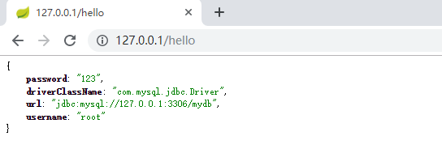

第二单元 SpringBoot基本配置
==================

【授课重点】
============

1.  SpringBoot核心配置文件；
2.  自定义配置文件；
3.  SpringBoot引入XML配；
4.  开发、测试、生产环境配置使用；
5.  SpringBoot集成Mybatis；

【考核要求】
============

1.  掌握application.properties和application.yml两种配置文件的使用
2.  会自定义配置文件并使用
3.  掌握spring XML格式的配置文件在SpringBoot中如何使用
4.  掌握开发、测试、生产环境配置文件的使用

【教学内容】
============

2.1 课程导入
--------

Spring Boot 推崇**约定大于配置**的方式以便于你能够尽可能快速的启动并运行程序。

在一般情况下，我们不需要做太多的配置就能够让spring boot正常运行。在一些特殊的情况下，我们需要做修改一些配置，或者需要有自己的配置属性。

>  任何程序都或多或少的配置文件，SpringBoot约定application开头的文件作为默认的配置文件。

2.2 SpringBoot核心配置文件
---------

当我们创建一个springboot项目的时候，系统默认会为我们在src/main/java/resources目录下创建一个application.properties。常用的配置文件格式有：application.properties、application.yml 两种。 

**application.properties**

```properties
#应用名称
spring.application.name=spring-boot-demo
#server端口配置
server.port=80
#应用的上下文路径
server.servlet.context-path=/
#图片访问路径前缀
file.domain=http://127.0.0.1:${server.port}/
#图片存放路径
file.path=c:/local/img/
#静态资源配置
spring.resources.static-locations=file:${file.path}
```

**application.yml**

```yml
spring:
  application:
    name: spring-boot-demo
  resources:
    static-locations: file:${file.path}
server:
  port: 80
  servlet:
    context-path: /demo/
file:
  domain: http://127.0.0.1:${server.port}/
  path: c:/local/img/

```

## 2.3 读取程序配置

**将配置文件的属性赋值给实体类**  读取上述配置文件中的**file.domain**、**file.path**

```java
@Configuration
@ConfigurationProperties(prefix = "file")
public class FileUploadConfig {
    
    private String path;
    private String domain;
	
    //getter setter 方法
}
```

prefix = "file" 指定配置文件中的前缀

**也可以在src/main/java/resources下自定义：jdbc.properties 文件**

```properties
jdbc.driverClassName=com.mysql.jdbc.Driver
jdbc.url=jdbc:mysql://127.0.0.1:3306/mydb
jdbc.username=root
jdbc.password=123
```

读取Jdbc.properties文件中的内容到实体类

```java
@Configuration
@PropertySource("classpath:jdbc.properties")
public class JdbcConfig {

    @Value("${jdbc.url}")
    String url;
    @Value("${jdbc.driverClassName}")
    String driverClassName;
    @Value("${jdbc.username}")
    String username;
    @Value("${jdbc.password}")
    String password;
}
```

- `@Configuration`：声明我们`JdbcConfig`是一个配置类
- `@PropertySource`：指定属性文件的路径是:`classpath:jdbc.properties`
- 通过`@Value`为属性注入值

  我们在`HelloController`中测试：

```java
@RestController
public class HelloController {

    @Autowired
    private JdbcConfig jdbcConfig;

    @GetMapping("hello")
    public Object hello(){
        Map<String,Object> jdbcConfigMap = new HashMap<>();
        jdbcConfigMap.put("url",jdbcConfig.getUrl());
        jdbcConfigMap.put("driverClassName",jdbcConfig.getDriverClassName());
        jdbcConfigMap.put("username",jdbcConfig.getUsername());
        jdbcConfigMap.put("password",jdbcConfig.getPassword());
        return jdbcConfigMap;
    }
}
```

**浏览器访问：**

 

## 2.4 SpringBoot引入XML配置

使用SpringBoot的主要思想是约定大于配置，使用Java配置代替XML配置。
在实际应用开发过程中也会存在不得不添加配置文件的情况，例如集成其他框架或者需要配置一些中间件等，在这种情况下，就需要引入自定义的xml配置文件。

### 2.4.1 编写Bean类

```java
public class UserBean {
	public UserBean(){
		System.out.println("我是有外部xml实例化的");
	}
}
```

### 2.4.2 编写spring配置文件

在src/main/java/resources目录下创建一个application-bean.xml

```xml
<?xml version="1.0" encoding="UTF-8"?>
<beans xmlns="http://www.springframework.org/schema/beans"
       xmlns:xsi="http://www.w3.org/2001/XMLSchema-instance"
       xsi:schemaLocation="http://www.springframework.org/schema/beans
	 http://www.springframework.org/schema/beans/spring-beans-3.0.xsd">
    <bean id="UserBean" class="com.bawei.springboot.demo.bean.UserBean"></bean>
</beans>
```

### 2.4.3  在启动类上添加注解 

```java
@SpringBootApplication
@ImportResource(locations = {"classpath:application-bean.xml"})
public class Application {
    public static void main(String[] args) {
        SpringApplication.run(Application.class,args);
    }
}
```

 测试启动时，控制台会打印构造方法中输出的内容。 

### 2.4.4 Bean注解使用

```java
@SpringBootApplication
public class SpringBootDemoApplication {
    public static void main(String[] args) {
        SpringApplication.run(Application.class,args);
    }
    
    //SpringBoot中Ioc注入Bean的方式
    @Bean
    public UserBean userBean(){
        return new UserBean();
    }
}
```

## 2.5 环境配置文件

在现实的开发环境中，我们需要不同的配置环境；

格式为application-{profile}.properties，其中{profile}对应你的环境标识，比如：

- application-dev.properties：开发环境
- application-test.properties：测试环境
- application-prod.properties：生产环境

**application-test.properties**

```properties
 server.port=8081
```

**application-dev.properties**

```properties
 server.port=8082
```

**application-prod.properties**

```properties
 server.port=8083
```

怎么使用？只需要我们在application.properties中加：

```properties
 spring.profiles.active=dev
```

spring.profiles.active指定不同的环境标识，启动工程，发现程序的端口不同。 

## 2.6 SpringBoot集成Mybatis

### 2.6.1导入依赖

```xml
<!-- 父坐标，SpringBoot版本-->
<parent>
    <groupId>org.springframework.boot</groupId>
    <artifactId>spring-boot-starter-parent</artifactId>
    <version>2.2.5.RELEASE</version>
    <relativePath/> <!-- lookup parent from repository -->
</parent>
<!-- 相关依赖-->
<dependencies>
    <!-- Web依赖-->
    <dependency>
        <groupId>org.springframework.boot</groupId>
        <artifactId>spring-boot-starter-web</artifactId>
    </dependency>
    <!-- mysql驱动-->
    <dependency>
        <groupId>mysql</groupId>
        <artifactId>mysql-connector-java</artifactId>
        <scope>runtime</scope>
    </dependency>
    <!-- mybatis starter-->
    <dependency>
        <groupId>org.mybatis.spring.boot</groupId>
        <artifactId>mybatis-spring-boot-starter</artifactId>
        <version>1.3.2</version>
    </dependency>
    <!-- pagehelper分页插件 -->
    <dependency>
        <groupId>com.github.pagehelper</groupId>
        <artifactId>pagehelper-spring-boot-starter</artifactId>
        <version>1.2.3</version>
    </dependency>
    <!-- lombok -->
    <dependency>
        <groupId>org.projectlombok</groupId>
        <artifactId>lombok</artifactId>
        <optional>true</optional>
    </dependency>
    <!-- 热启动 -->
    <dependency>
        <groupId>org.springframework.boot</groupId>
        <artifactId>spring-boot-devtools</artifactId>
    </dependency>
</dependencies>
```

### 2.6.2 添加配置

```properties
spring.application.name=springboot-demo
server.port=8080
#配置数据源
spring.datasource.url=jdbc:mysql://localhost:3306/1707d?useUnicode=true&characterEncoding=utf8&serverTimezone=Asia/Shanghai
spring.datasource.username=root
spring.datasource.password=root
spring.datasource.driver-class-name=com.mysql.cj.jdbc.Driver
spring.datasource.type=com.zaxxer.hikari.HikariDataSource
#mybatis配置
mybatis.mapper-locations=classpath:mappers/*.xml
mybatis.type-aliases-package=com.zhanggm.springboot.pojo
```

### 2.6.3 添加启动类

```java
@SpringBootApplication
@MapperScan("com.zhanggm.springboot.mapper")
public class SpringBootDemoApplication {
    public static void main(String[] args) {
        SpringApplication.run(SpringBootDemoApplication.class,args);
    }
}
```

### 2.6.4 添加User类

```java
@Data
public class User {
    private Integer id;
    private String username;
}
```

### 2.6.5 添加UserMapper接口

```java
@Repository
public interface UserMapper {
    List<User> select();
}
```

### 2.6.6 添加UserController

实现分页接口

```java
@Controller
public class UserController {

    @Autowired
    private UserMapper userMapper;
    
	//分页列表接口
    @RequestMapping("getPageInfo")
    public PageInfo<User> getPageInfo(User user, 
            @RequestParam(value = "pageNum",defaultValue = "1") Integer pageNum,
            @RequestParam(value = "pageSize",defaultValue = "2") Integer pageSize){
        PageHelper.startPage(pageNum,pageSize);
        List<User> userList = userDao.select();
        return new PageInfo<>(userList);
    }
}
```

