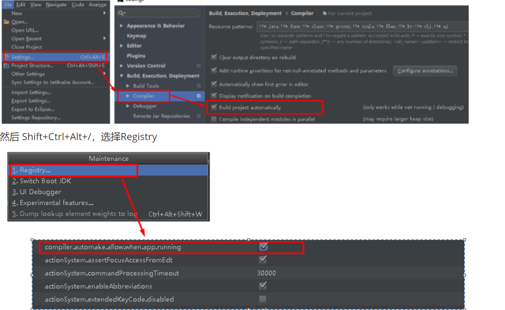
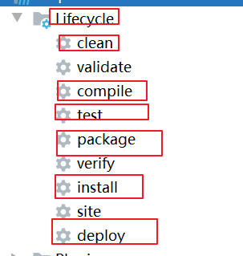
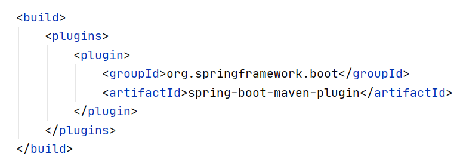
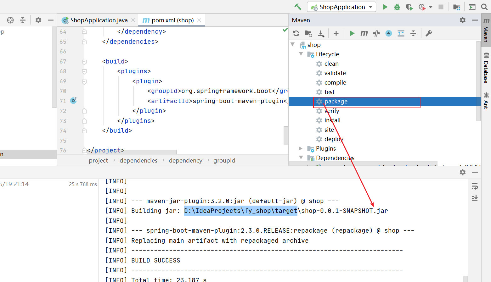
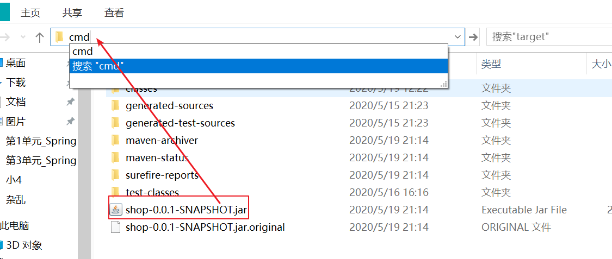
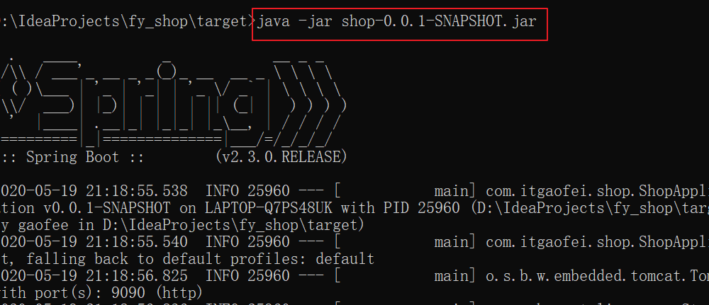
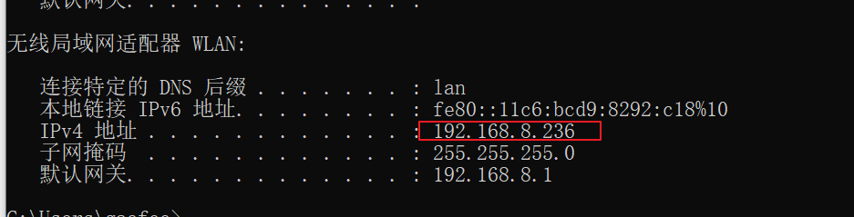
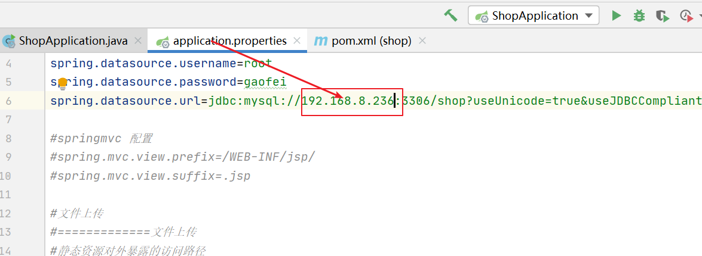
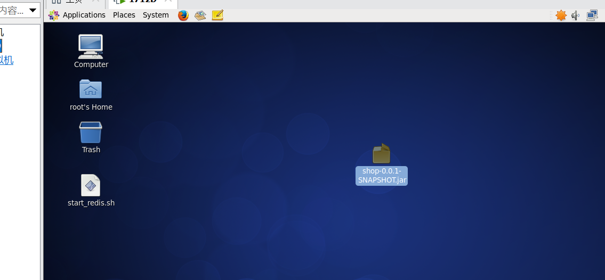
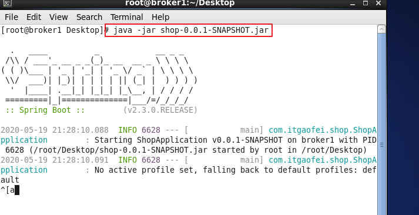

第三单元 SpringBoot程序部署
==================

【授课重点】
============

1.  **SpringBoot热部署**；
2.  **SpringBoot程序Logo定制**；
3.  SpringBoot程序打包；
4.  **SpringBoot与Web容器**；
5.  **SpringBoot项目生产环境Linux系统部署**
6.  SpringBoot程序监控

【考核要求】
============

1. **SpringBoot热部署**；

2. **SpringBoot程序Logo定制**；

3. SpringBoot程序打包；

4. **SpringBoot与Web容器**；

5. **SpringBoot项目生产环境Linux系统部署**

6. SpringBoot程序监控

   

【教学内容】
============

4.1 课程导入
--------

springboot作为一个"简化ssm" 就是同样是为了我们的web开发的,那么既然是为了web开发,就免不了项目的部署

这节课我们着重学习下springboot的部署!

## 4.2 SpringBoot热部署

- 为什么要热部署？

  我们再日常开发的时候,会发现,我们只要修改一下后端代码,就需要重启下服务,重新编译下,非常耗时

  现在我们有了热部署的概念:就是无论何时修改代码,自动编译,避免了重复启动服务,而造成的时间浪费!

- spring-boot-devtools解决方案原理与应用

  该原理其实很好说明，就是我们在编辑器上启动项目，然后改动相关的代码，然后编辑器自动触发编译替换掉历史的.class文件后，项目检测到有文件变更后会重启srpring-boot项目。
   可以看看官网的触发描述：
   As DevTools monitors classpath resources, the only way to trigger a restart is to update the classpath. The way in which you cause the classpath to be updated depends on the IDE that you are using. In Eclipse, saving a modified file causes the classpath to be updated and triggers a restart. In IntelliJ IDEA, building the project (Build +→+ Build Project) has the same effect.
   可以看到，我们引入了插件后，插件会监控我们classpath的资源变化，当classpath有变化后，会触发重启。很多文章会介绍如何配置自动触发，本人觉得不是很喜欢这种配置，当我们改动代码时，并不是改动一下就改动完的，我还是喜欢自己点击Build Project来触发重启。
   The restart technology provided by Spring Boot works by using two classloaders. Classes that do not change (for example, those from third-party jars) are loaded into a base classloader. Classes that you are actively developing are loaded into a restart classloader. When the application is restarted, the restart classloader is thrown away and a new one is created. This approach means that application restarts are typically much faster than “cold starts”, since the base classloader is already available and populated.
   这里提到了，该插件重启快速的原因：这里对类加载采用了两种类加载器，对于第三方jar包采用base-classloader来加载，对于开发人员自己开发的代码则使用restartClassLoader来进行加载，这使得比停掉服务重启要快的多，因为使用插件只是重启开发人员编写的代码部分。

- 热部署增强配置

  首先导入依赖:

  ```xml
  		<dependency>
              <groupId>org.springframework.boot</groupId>
              <artifactId>spring-boot-devtools</artifactId>
              <scope>runtime</scope>
              <optional>true</optional>
          </dependency>
  ```

  

  其次要进行idea的设置:

   

  此时热部署就已经完成!!

  

## 4.3 SpringBoot程序Logo定制

- banner.txt文件与变量获取

- 字符Logo生成工具：http://patorjk.com/software/taag

  详情参看:<https://blog.csdn.net/wo541075754/article/details/52540129>

## 4.4 SpringBoot程序打包

- Maven常用生命周期回顾

   

  通过再idea工具中我们可以看到maven的生命周期相关命令!

- SpringBoot Maven打包插件配置

  再pom文件里引入如下依赖

  

  

  然后我们按照如下操作:

   

  此时会发现:我们已经成功的打了一个jar包

  找到此jar包:

   

  此处输入cmd命令

  执行如下命令:

   

  浏览器访问:

   

  此时,我们已经成功的打成了jar包,且成功启动,访问!

- 打包可执行JAR包及JarLauncher原理

  参看:<https://blog.csdn.net/z69183787/article/details/104238083>

- 打包可执行WAR包及WarLauncher原理

  参看:<https://blog.csdn.net/z69183787/article/details/104238083>

## 4.5 SpringBoot项目生产环境Linux系统部署

找到windows的ip

 

修改springboot项目的数据库连接

 

我们按照4.4的操作打jar包上传到linux系统中

 

然后打开命令窗口:

 

启动成功后再浏览器访问:

 

ok,项目成功部署到linux系统里了

## 4.6 springboot程序监控

详情参看:<https://www.jianshu.com/p/0d48de1422d0>