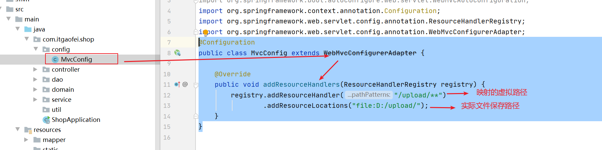
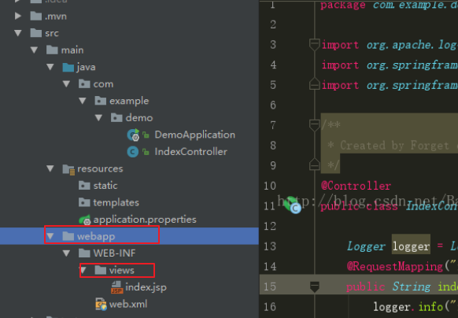

第五单元 SpringBoot相关组件
==================

【授课重点】
============

1.  **SpringBoot与SpringMVC组件**
2.  **SpringBoot与JavaWeb原生组件**
3.  **SpringBoot与Spring组件**

【考核要求】
============

1. **SpringBoot与SpringMVC组件**
2. **SpringBoot与JavaWeb原生组件**
3. **SpringBoot与Spring组件**

【教学内容】
============

5.1 课程导入
--------

前面几单元我们对spring的相关原理,已经有了初步的认识,下面我们开始进行对springboot集成一些相关组件,从而

发挥springboot的强大的功能!!

## 5.2 SpringBoot与SpringMVC组件

- WebMvcConfigurer扩展：静态资源映射

  我们在上传文件的时候,往往会遇到一个问题: 如果上传到本地磁盘(windows,或者Linux),那么,再浏览器端是无法映射此路径的!因此我们之前的解决方式是再jetty或者tomcat中配置虚拟路径!

  那么springboot是如何配置静态资源映射的呢?很简单如图:

   

- WebMvcConfigurer扩展：消息转换器

  参看:<https://www.cnblogs.com/huangwentian/p/10374996.html>

- WebMvcConfigurer扩展：拦截器

  参看:<https://www.cnblogs.com/huangwentian/p/10374996.html>

- WebMvcConfigurer扩展：跨域映射

  参看:<https://www.cnblogs.com/huangwentian/p/10374996.html>

## 5.3 **SpringBoot与JavaWeb原生组件**

- SpringBoot中使用原生JSP

  - **视图支持**

    Springboot的默认视图支持是Thymeleaf，但是Thymeleaf我们不熟悉，我们熟悉的还是jsp。 所以下面是讲解如何让Springboot支持 jsp

  - **基于前面的springBoot入门小demo**

  - **修改pom.xml文件，添加对jsp支持**

    ```xml
    		<dependency>
                  <groupId>junit</groupId>
                  <artifactId>junit</artifactId>
                  <scope>test</scope>
            </dependency>
            <!-- 部署tomcat,排除冲突-->
            <dependency>
                    <groupId>org.springframework.boot</groupId>
                 <artifactId>spring-boot-starter-tomcat</artifactId>
                <scope>provided</scope>
            </dependency>
             <!-- servlet依赖 -->
            <dependency>
                  <groupId>javax.servlet</groupId>
                  <artifactId>javax.servlet-api</artifactId> 
            </dependency>
            <dependency>
                  <groupId>javax.servlet</groupId>
                  <artifactId>jstl</artifactId>
            </dependency>
            <!-- tomcat的支持-->
            <dependency>
                   <groupId>org.apache.tomcat.embed</groupId>
                   <artifactId>tomcat-embed-jasper</artifactId>
            </dependency>     
    ```

  - 然后我们再application.properties里加入如下视图解析器配置

    ```properties
    spring.mvc.view.prefix=/WEB-INF/views/
    spring.mvc.view.suffix=.jsp
    ```

  - **修改HelloController类**

    ```java
    @Controller
    public class HelloController {
    
        @RequestMapping("/hello")
        public String hello(Model m){
            m.addAttribute("now",DateFormat.getDateTimeInstance().format(new Date()));
            return "index";  //视图重定向index.jsp
        }
    }
    ```

  - 再springboot项目加入如下目录结构

     

    

  - SpringBoot中使用原生Servlet

    再上门基础上使用Servlet:

    ```java
    /**
     * 在SpringBoot中通过代码注册的方式来注册Servlet
     * @author gaofei
     */
    public class MyServlet extends HttpServlet{
    
        @Override
        protected void doGet(HttpServletRequest req, HttpServletResponse resp) throws ServletException, IOException {
            System.out.println("-----------doGet----------------");
            doPost(req, resp);
        }
    
        @Override
        protected void doPost(HttpServletRequest req, HttpServletResponse resp) throws ServletException, IOException {
            System.out.println("-----------doPost----------------");
            resp.getWriter().print("<h1>Hello MyServlet Response return you this</h1>");
        }
    
        @Override
        public void init() throws ServletException {
            super.init();
        }
    }
    
    ```

    

  - SpringBoot中使用原生Filter

    再上面项目基础上:

    ```java
     public class LoggingFilter implements Filter{
            private static final Logger logger = LoggerFactory.getLogger(LoggingFilter.class);
    
            @Override
            public void init(FilterConfig filterConfig) throws ServletException {
    
            }
    
            @Override
            public void doFilter(ServletRequest request, ServletResponse response, FilterChain chain) throws IOException, ServletException {
                logger.info("LoggingFilter work");
            }
    
            @Override
            public void destroy() {
    
            }
        }
    
    ```

    之后再次用配置类声明下:

    ```java
     @Configuration
        public class FilterConfig {
    
            @Bean
            public Filter loggingFilter(){
                return new LoggingFilter();
            }
        }
    
    ```

    

  - SpringBoot中使用原生Listener

    参看:<https://www.cnblogs.com/RPlandscape/p/10036551.html>

## 5.4 **SpringBoot与Spring组件**

- SpringBoot中使用定时器

  参看:<https://www.cnblogs.com/jylee/p/11528080.html>

- SpringBoot中使用线程池

  参看:<https://www.cnblogs.com/yw0219/p/8810956.html>