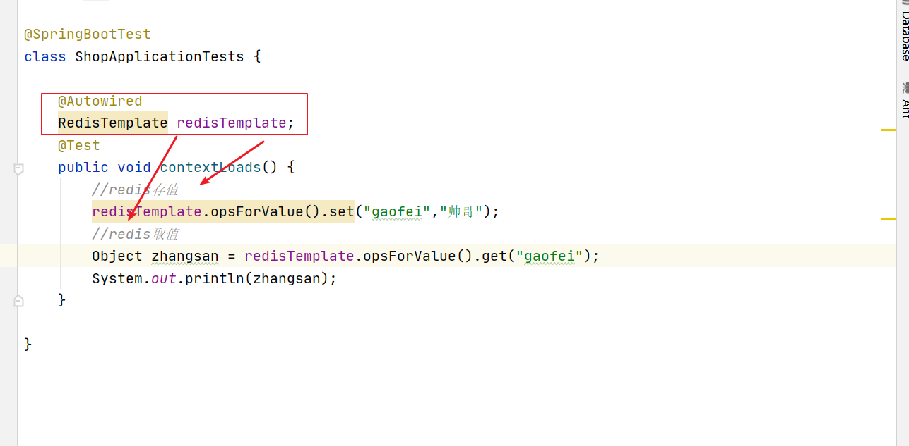
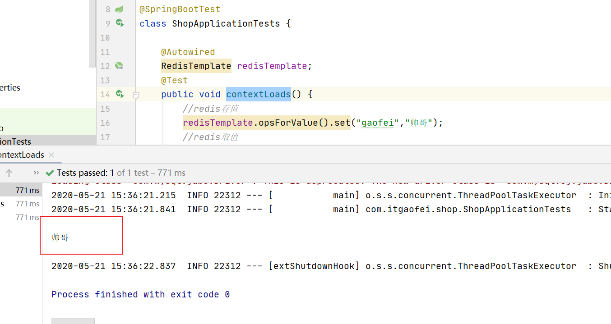
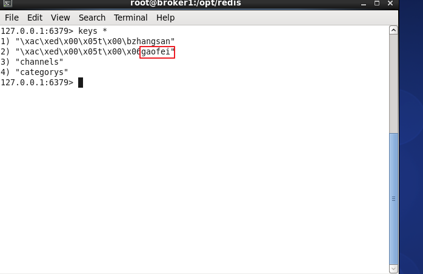
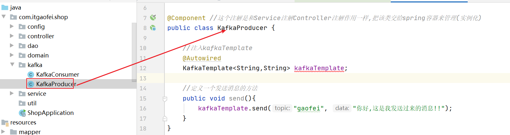
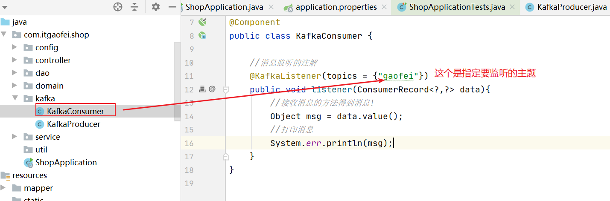
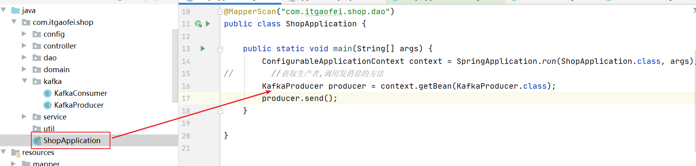
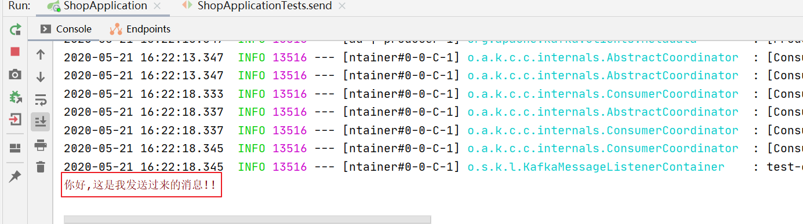
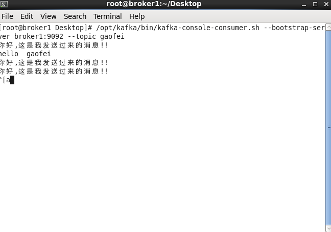
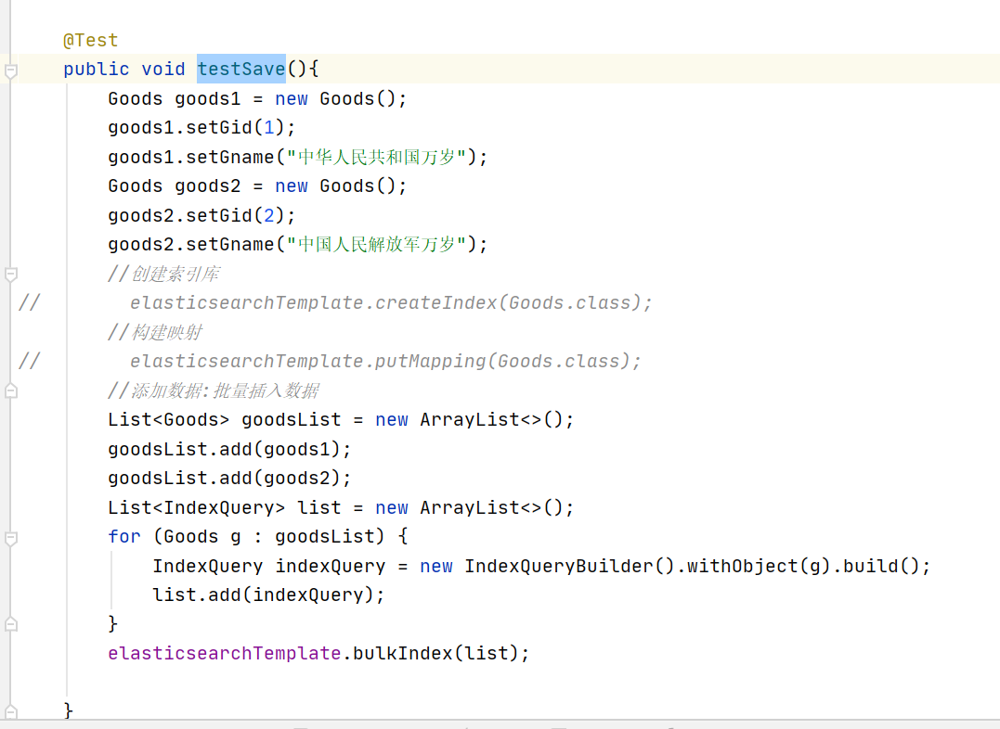
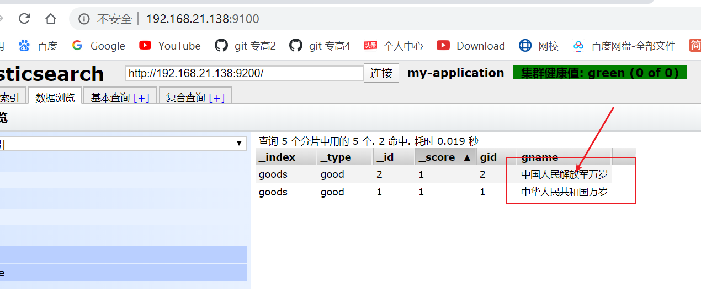

第六单元 SpringBoot集成相关高性能技术
==================

【授课重点】
============

1. **SpringBoot与Redis集成**
2. **SpringBoot与Kafka集成**
3. **SpringBoot与ElasticsearchTemplate集成**

【考核要求】
============

1. **SpringBoot与Redis集成**
2. **SpringBoot与Kafka集成**
3. **SpringBoot与ElasticsearchTemplate集成**

【教学内容】
============

6.1 课程导入
--------

springboot作为一个"骨架工程"只有集成了一些常用的技术才能"有血有肉"!

这节课我们学习springboot集成redis,kakfa,es技术!

## 6.2 SpringBoot与Redis集成

- Redis技术复习

  redis作为一个高性能的非关系型数据库,我们使用的非常频繁!它具有5中数据类型:string,list,hash,set,zset

- 集成redis技术,并使用

  - springboot集成redis我们是不是有点似曾相识?大家回想下小二的时候,我们学习的ssm整合redis的步骤:

    1. 导入依赖
    2. 编写配置文件
    3. 注入RedisTemplate

    同理:boot中集成redis一样的步骤,我们先导入依赖:

    ```xml
    <!--redis-->
            <dependency>
                <groupId>org.springframework.boot</groupId>
                <artifactId>spring-boot-starter-data-redis</artifactId>
            </dependency>
    ```

  - 然后编写配置文件

    ```properties
    #redis
    spring.redis.host=192.168.21.138
    spring.redis.port=6379
    ```

  - 注入RedisTemplate使用

     

    ok,这个就是我们redis的整合和使用步骤了

    来看运行效果:

     

    linux里的redis客户端效果:

     

  

## 6.3 SpringBoot与Kafka集成

- Kafka技术复习

  我们先来回顾下kakfa技术:

  Kafka是一个分布式消息队列。★Kafka对消息保存时根据Topic进行归类，发送消息者称为Producer，消息接受者称为Consumer，此外kafka集群有多个kafka实例组成，每个实例(server)称为broker。无论是kafka集群，还是consumer都依赖于zookeeper集群保存一些meta信息，来保证系统可用性
  整体流程:  Producer--->Broker------>Consumer

  生产者发送消息到kafka节点,消费者监听节点中对应主题的消息并且消费!

- springboot与kafka的集成

  - 首先我们导入依赖

    ```xml
    		<dependency>
                <groupId>org.springframework.kafka</groupId>
                <artifactId>spring-kafka</artifactId>
            </dependency>
    ```

  - 接下来我们编写配置文件

    ```properties
    #============== kafka ===================
    # 指定kafka 代理地址，可以多个
    spring.kafka.bootstrap-servers=127.0.0.1:9092
    
    #=============== provider  =======================
    
    spring.kafka.producer.retries=0
    # 每次批量发送消息的数量
    spring.kafka.producer.batch-size=16384
    spring.kafka.producer.buffer-memory=33554432
    
    # 指定消息key和消息体的编解码方式
    spring.kafka.producer.key-serializer=org.apache.kafka.common.serialization.StringSerializer
    spring.kafka.producer.value-serializer=org.apache.kafka.common.serialization.StringSerializer
    
    #=============== consumer  =======================
    # 指定默认消费者group id
    spring.kafka.consumer.group-id=test-consumer-group
    
    spring.kafka.consumer.auto-offset-reset=earliest
    spring.kafka.consumer.enable-auto-commit=true
    spring.kafka.consumer.auto-commit-interval=100
    
    # 指定消息key和消息体的编解码方式
    spring.kafka.consumer.key-deserializer=org.apache.kafka.common.serialization.StringDeserializer
    spring.kafka.consumer.value-deserializer=org.apache.kafka.common.serialization.StringDeserializer
    ```

  - 编写生产者(用来发消息)

     

  - 编写消费者(用来监听消息)

     

  - 测试

    再springboot的启动类中测试

     

  - 测试结果如下:

     

    kakfa后台接受的消息如下:

     

    到目前为止,咱们的kafka和boot的集成已经完成!

    和咱们小二学习的整合思路是完全一致的!!生产者发送消息,消费者监听消息!

## 6.4 SpringBoot与ElasticsearchTemplate集成

- Elasticsearch技术复习

  我们学习es的目的是为了全文检索,所谓全文检索:即全文搜索!他的性能非常高如果我们查询一些经常被访问,并发量非常大的数据,每次从mysql中查询,会导致mysql宕机的风险!因此es和solr就应运而生了!

  我们知道es为什么那么快吗?--------------->倒排索引!!

- springboot集成es

  - 首先我们导入依赖

    ```xml
    		<dependency>
                <groupId>org.springframework.boot</groupId>
                <artifactId>spring-boot-starter-data-elasticsearch</artifactId>
            </dependency>
    
    ```

    

  - 编写配置文件

    ```properties
    #ElasticSearch 配置//名字必须和elasticsearch.yml里面的cluster.name相同
    spring.data.elasticsearch.cluster-name=my-application
    spring.data.elasticsearch.cluster-nodes=192.168.21.138:9300
    ```

  - 编写实体类

    ```java
    @Data
    @Getter
    @Setter
    @ToString
    @EqualsAndHashCode
    @Document(indexName = "goods" ,type="good")
    public class Goods implements Serializable {
    
        @Id
        private Integer gid;
        @Field(index = true,store = true,searchAnalyzer = "ik_max_word",analyzer = "ik_max_word",type = FieldType.Text)
        private String gname;
        private Double gprice;
        private Integer gnum;
        private String pic;
        private String desc;
        @DateTimeFormat(pattern = "yyyy-MM-dd")
        private Date gdate;
    }
    ```

  - 测试:

     

  - 最终得到的结果:

     

    ok,大功告成!