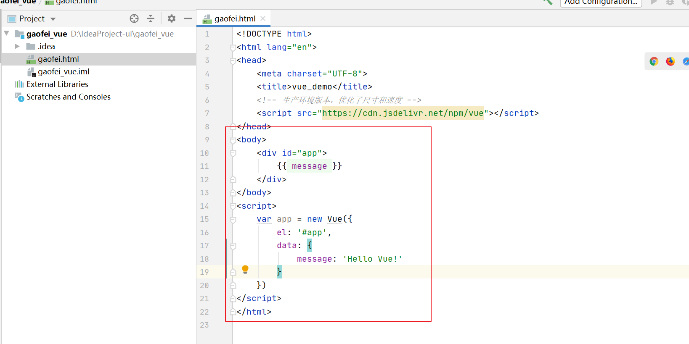
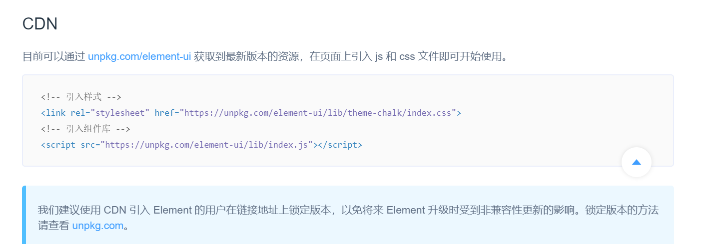

# 第8单元  ElementUI 框架入门

# 【授课重点】

1. VUE 环境搭建(CDN引入VUE)
2. 简单入门案例
3. VUE实例/模板/数据/方法
4. 基本指令

# 【考核要求】

1. VUE 环境搭建(CDN引入VUE)
2. 简单入门案例
3. VUE实例/模板/数据/方法
4. 基本指令

# 【教学内容】

## 8.1 **VUE简易入门**

vue环境搭建

vue是什么?

Vue (读音 /vjuː/，类似于 view) 是一套用于构建用户界面的渐进式[JavaScript](https://baike.baidu.com/item/JavaScript/321142)框架。与其它大型框架不同的是，Vue 被设计为可以自底向上逐层应用。Vue 的核心库只关注视图层，方便与第三方库或既有项目整合。

为什么要学习vue?

**易用**

在有HTML CSS JavaScript的基础上，快速上手。

**灵活**

简单小巧的核心，渐进式技术栈，足以应付任何规模的应用。

**性能**

20kb min+gzip 运行大小、超快虚拟 [DOM](https://baike.baidu.com/item/DOM/50288) 、最省心的优化。

如何搭建vue环境?

首先我们打开官网:<https://cn.vuejs.org/>

 

就会看到如下界面:

 

如上图所示:我们想要搭建一个vue环境,只需要再普通的静态前端工程里引入相关js文件即可,因此我们可以创建一个项目,使用CDN的方式来引入vue.js进一步使用vue

首先我们打开idea,创建一个项目:

 

然后:

 

 

接下来点击Finish完成即可:

 

此时我们的静态项目已经创建好

接下来:

 

新建一个html文件叫gaofei.html

然后我们按照vue的官网介绍,cdn引入vue.js

 

 

接下来我们按照vue的官方介绍先来一个demo:

 

上图是官方给的demo

此时我们打开浏览器来访问下:

 

 

ok,快速入门我们已经完成,接下来我们分别介绍下vue的实例/模板/数据/方法 

- 实例

  <https://www.runoob.com/vue2/vue-examples.html>

- 模板

  <https://www.runoob.com/vue2/vue-template-syntax.html>

- 数据

  <https://www.runoob.com/vue2/vue-component.html>

- 方法

  <https://www.runoob.com/vue2/vue-component.html>

## 8.2 **ElementUI简介** 

接下来我们介绍下基于vue的一些优秀的前端ui框架:ElementUI

官网地址:<https://element.eleme.cn/#/zh-CN>

 

## 8.3 **引入(CDN引入库)**	

 

## 8.4 布局

 

## 8.5 容器

 

## 8.6 边框

<https://element.eleme.cn/#/zh-CN/component/installation>

## 8.7 色彩

<https://element.eleme.cn/#/zh-CN/component/installation>

## 8.8 字体

<https://element.eleme.cn/#/zh-CN/component/installation>

## 8.9 图标

<https://element.eleme.cn/#/zh-CN/component/installation>

## 8.10 按钮

<https://element.eleme.cn/#/zh-CN/component/installation>

## 8.11 Form表单

<https://element.eleme.cn/#/zh-CN/component/installation>

