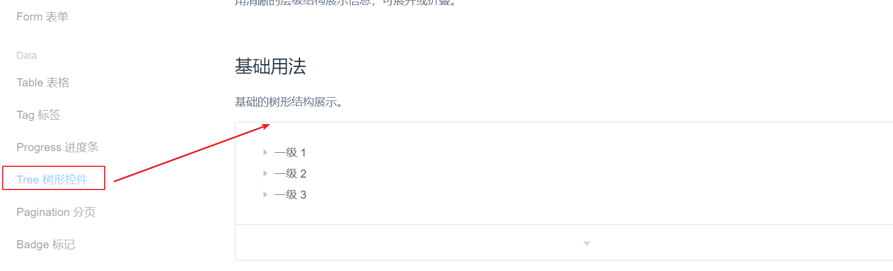

# 第9单元  ElementUI框架组件介绍

# 【授课重点】

1. **数据组件**

2. **通知框组件**

3. **导航组件**

4. **其它组件**

   

# 【考核要求】

1. **数据组件**
2. **通知框组件**
3. **导航组件**
4. **其它组件**

# 【教学内容】

## 9.1数据组件

数据组件:

 

我们首先来看Table表格:

 

点击显示代码:

当`el-table`元素中注入`data`对象数组后，在`el-table-column`中用`prop`属性来对应对象中的键名即可填入数据，用`label`属性来定义表格的列名。可以使用`width`属性来定义列宽。

```html
<template>
    <el-table
      :data="tableData"
      style="width: 100%">
      <el-table-column
        prop="date"
        label="日期"
        width="180">
      </el-table-column>
      <el-table-column
        prop="name"
        label="姓名"
        width="180">
      </el-table-column>
      <el-table-column
        prop="address"
        label="地址">
      </el-table-column>
    </el-table>
  </template>

  <script>
    export default {
      data() {
        return {
          tableData: [{
            date: '2016-05-02',
            name: '王小虎',
            address: '上海市普陀区金沙江路 1518 弄'
          }, {
            date: '2016-05-04',
            name: '王小虎',
            address: '上海市普陀区金沙江路 1517 弄'
          }, {
            date: '2016-05-01',
            name: '王小虎',
            address: '上海市普陀区金沙江路 1519 弄'
          }, {
            date: '2016-05-03',
            name: '王小虎',
            address: '上海市普陀区金沙江路 1516 弄'
          }]
        }
      }
    }
  </script>
```

由以上组件代码可以看出,表格数据的显示和tableData这个数据是紧密相关的!我们只需要把tableData的数据准备好,就可以在此组件完美显示了!

接下来,我们看树形控件:

 

```html
<el-tree :data="data" :props="defaultProps" @node-click="handleNodeClick"></el-tree>

<script>
  export default {
    data() {
      return {
        data: [{
          label: '一级 1',
          children: [{
            label: '二级 1-1',
            children: [{
              label: '三级 1-1-1'
            }]
          }]
        }, {
          label: '一级 2',
          children: [{
            label: '二级 2-1',
            children: [{
              label: '三级 2-1-1'
            }]
          }, {
            label: '二级 2-2',
            children: [{
              label: '三级 2-2-1'
            }]
          }]
        }, {
          label: '一级 3',
          children: [{
            label: '二级 3-1',
            children: [{
              label: '三级 3-1-1'
            }]
          }, {
            label: '二级 3-2',
            children: [{
              label: '三级 3-2-1'
            }]
          }]
        }],
        defaultProps: {
          children: 'children',
          label: 'label'
        }
      };
    },
    methods: {
      handleNodeClick(data) {
        console.log(data);
      }
    }
  };
</script>
```

同理:树形菜单的显示,同样是和数据data相关,我们还是按照data里给定数据的格式,准备好数据,树形就可以完美展示了!

控件可以参考:<https://element.eleme.cn/#/zh-CN/component/table>

## 9.2通知框组件

 

- Alert警告:

Alert 组件提供四种主题，由`type`属性指定，默认值为`info`。

```html
<template>
  <el-alert
    title="成功提示的文案"
    type="success">
  </el-alert>
  <el-alert
    title="消息提示的文案"
    type="info">
  </el-alert>
  <el-alert
    title="警告提示的文案"
    type="warning">
  </el-alert>
  <el-alert
    title="错误提示的文案"
    type="error">
  </el-alert>
</template>
```

- Loading加载

  

```html
Element 提供了两种调用 Loading 的方法：指令和服务。对于自定义指令v-loading，只需要绑定Boolean即可。默认状况下，Loading 遮罩会插入到绑定元素的子节点，通过添加body修饰符，可以使遮罩插入至 DOM 中的 body 上。
<template>
  <el-table
    v-loading="loading"
    :data="tableData"
    style="width: 100%">
    <el-table-column
      prop="date"
      label="日期"
      width="180">
    </el-table-column>
    <el-table-column
      prop="name"
      label="姓名"
      width="180">
    </el-table-column>
    <el-table-column
      prop="address"
      label="地址">
    </el-table-column>
  </el-table>
</template>

<style>
  body {
    margin: 0;
  }
</style>

<script>
  export default {
    data() {
      return {
        tableData: [{
          date: '2016-05-03',
          name: '王小虎',
          address: '上海市普陀区金沙江路 1518 弄'
        }, {
          date: '2016-05-02',
          name: '王小虎',
          address: '上海市普陀区金沙江路 1518 弄'
        }, {
          date: '2016-05-04',
          name: '王小虎',
          address: '上海市普陀区金沙江路 1518 弄'
        }],
        loading: true
      };
    }
  };
</script>
```

其他组件参考:<https://element.eleme.cn/#/zh-CN/component/alert>

## 9.3导航组件

 

- NavMenu 导航菜单

通过`el-menu-item-group`组件可以实现菜单进行分组，分组名可以通过`title`属性直接设定，也可以通过具名 slot 来设定

```html
<el-row class="tac">
  <el-col :span="12">
    <h5>默认颜色</h5>
    <el-menu
      default-active="2"
      class="el-menu-vertical-demo"
      @open="handleOpen"
      @close="handleClose">
      <el-submenu index="1">
        <template slot="title">
          <i class="el-icon-location"></i>
          <span>导航一</span>
        </template>
        <el-menu-item-group>
          <template slot="title">分组一</template>
          <el-menu-item index="1-1">选项1</el-menu-item>
          <el-menu-item index="1-2">选项2</el-menu-item>
        </el-menu-item-group>
        <el-menu-item-group title="分组2">
          <el-menu-item index="1-3">选项3</el-menu-item>
        </el-menu-item-group>
        <el-submenu index="1-4">
          <template slot="title">选项4</template>
          <el-menu-item index="1-4-1">选项1</el-menu-item>
        </el-submenu>
      </el-submenu>
      <el-menu-item index="2">
        <i class="el-icon-menu"></i>
        <span slot="title">导航二</span>
      </el-menu-item>
      <el-menu-item index="3" disabled>
        <i class="el-icon-document"></i>
        <span slot="title">导航三</span>
      </el-menu-item>
      <el-menu-item index="4">
        <i class="el-icon-setting"></i>
        <span slot="title">导航四</span>
      </el-menu-item>
    </el-menu>
  </el-col>
  <el-col :span="12">
    <h5>自定义颜色</h5>
    <el-menu
      default-active="2"
      class="el-menu-vertical-demo"
      @open="handleOpen"
      @close="handleClose"
      background-color="#545c64"
      text-color="#fff"
      active-text-color="#ffd04b">
      <el-submenu index="1">
        <template slot="title">
          <i class="el-icon-location"></i>
          <span>导航一</span>
        </template>
        <el-menu-item-group>
          <template slot="title">分组一</template>
          <el-menu-item index="1-1">选项1</el-menu-item>
          <el-menu-item index="1-2">选项2</el-menu-item>
        </el-menu-item-group>
        <el-menu-item-group title="分组2">
          <el-menu-item index="1-3">选项3</el-menu-item>
        </el-menu-item-group>
        <el-submenu index="1-4">
          <template slot="title">选项4</template>
          <el-menu-item index="1-4-1">选项1</el-menu-item>
        </el-submenu>
      </el-submenu>
      <el-menu-item index="2">
        <i class="el-icon-menu"></i>
        <span slot="title">导航二</span>
      </el-menu-item>
      <el-menu-item index="3" disabled>
        <i class="el-icon-document"></i>
        <span slot="title">导航三</span>
      </el-menu-item>
      <el-menu-item index="4">
        <i class="el-icon-setting"></i>
        <span slot="title">导航四</span>
      </el-menu-item>
    </el-menu>
  </el-col>
</el-row>

<script>
  export default {
    methods: {
      handleOpen(key, keyPath) {
        console.log(key, keyPath);
      },
      handleClose(key, keyPath) {
        console.log(key, keyPath);
      }
    }
  }
</script>
```


- Dropdown 下拉菜单

通过组件`slot`来设置下拉触发的元素以及需要通过具名`slot`为`dropdown` 来设置下拉菜单。默认情况下，下拉按钮只要`hover`即可，无需点击也会显示下拉菜单

```html
<el-dropdown>
  <span class="el-dropdown-link">
    下拉菜单<i class="el-icon-arrow-down el-icon--right"></i>
  </span>
  <el-dropdown-menu slot="dropdown">
    <el-dropdown-item>黄金糕</el-dropdown-item>
    <el-dropdown-item>狮子头</el-dropdown-item>
    <el-dropdown-item>螺蛳粉</el-dropdown-item>
    <el-dropdown-item disabled>双皮奶</el-dropdown-item>
    <el-dropdown-item divided>蚵仔煎</el-dropdown-item>
  </el-dropdown-menu>
</el-dropdown>

<style>
  .el-dropdown-link {
    cursor: pointer;
    color: #409EFF;
  }
  .el-icon-arrow-down {
    font-size: 12px;
  }
</style>
```

其他参考:<https://element.eleme.cn/#/zh-CN/component>

## 9.4其他组件

<https://element.eleme.cn/#/zh-CN/component>

